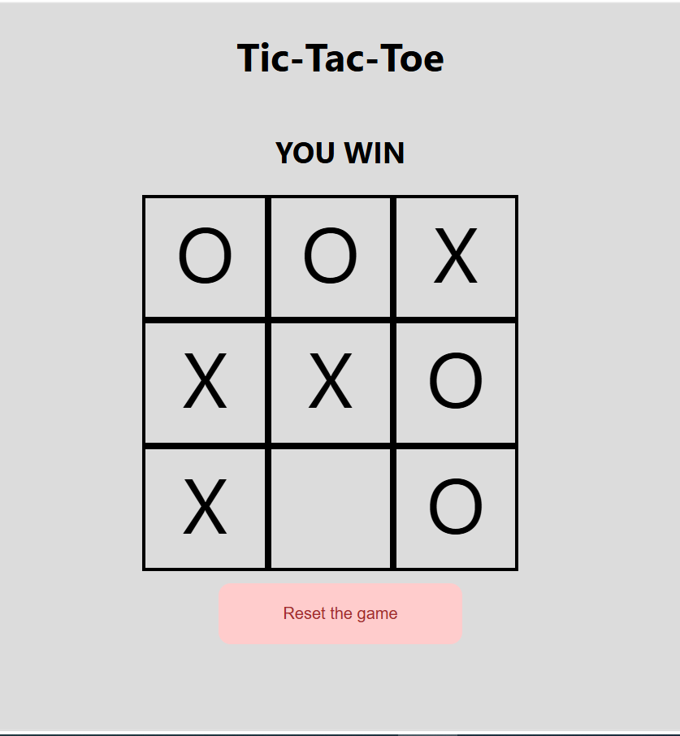

# Tic-Tac-Toe Game

## Technologies Used
- javascript
- css
- html

## Description
This is Tic-Tac-Toe game with robot that is choose a random plase to defeat you.

## User Stories
1. As a user, you can put a "X" by defult, and you cann't change it.
2. As a user, you can start the game, and also you have no choise with this.
3. As a user, you will win if you arrive 3 X's in the same row, colomn and diagonal, and you will lose if the robot fill one of these, and tie if no one, you nor robot, fill these.

## Screenshots

## Future Enhancements
- 1 to 1 game
- A smart robot
- (n x n) Tic-Tac-Toe, where n>2
- change the rule of the game

## Credits
1. Omar (The best teacher in tho hole world)
2. Omar (again and again ...)
3. Basem (my friend)
4. Nabel (my brevuse teacher in dataStructure corse)